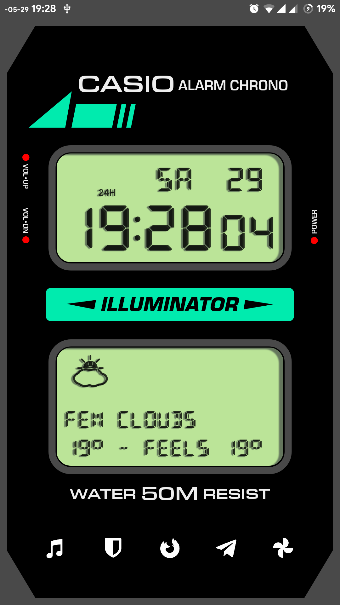
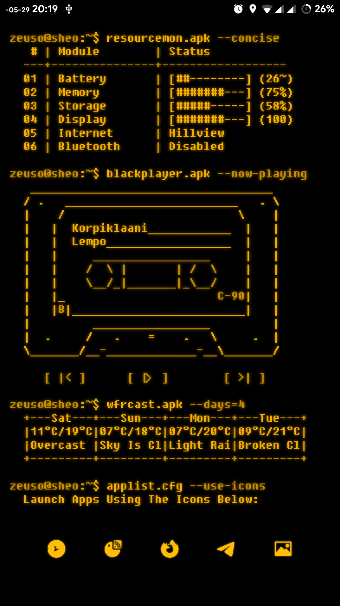

# KLWP Wallpapers

### Retro Gruvbox

Designed around the Gruvbox colourscheme, bright and vibrant

* Nova Settings:
  * Icon pack: Retrorika
  *  Grid: 6x6

* Fonts: Cooper black; Geomancy

​		

### Casio W-86 Illuminator

I love the Casio Illuminator, I think it's the superior model to the F91-W

* Nova Settings

  * Icon Pack: Flight

* Fonts: Eurostile (various); [DSeg7/14/Weather](https://www.keshikan.net/fonts-e.html)

  ​	

### Kustomfetch

Ubuntu, for all it's flaws, looks really nice by default (at least up until 18.04)

* Nova Settings
  * Icon Pack: MIUI 5

* Fonts: Ubuntu Mono

### Amber Terminal

Similar to kustomfetch, but designed to be a companion to my [WPE wallpaper](https://steamcommunity.com/sharedfiles/filedetails/?id=2271074053)

* Nova Settings
  * Icon Pack: Custom made with [IPS](https://www.iconpackstudio.com/)
* Fonts: [FixedSys Excelsior](https://github.com/kika/fixedsys)

