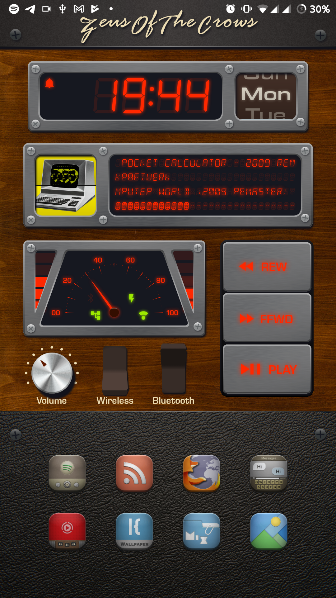
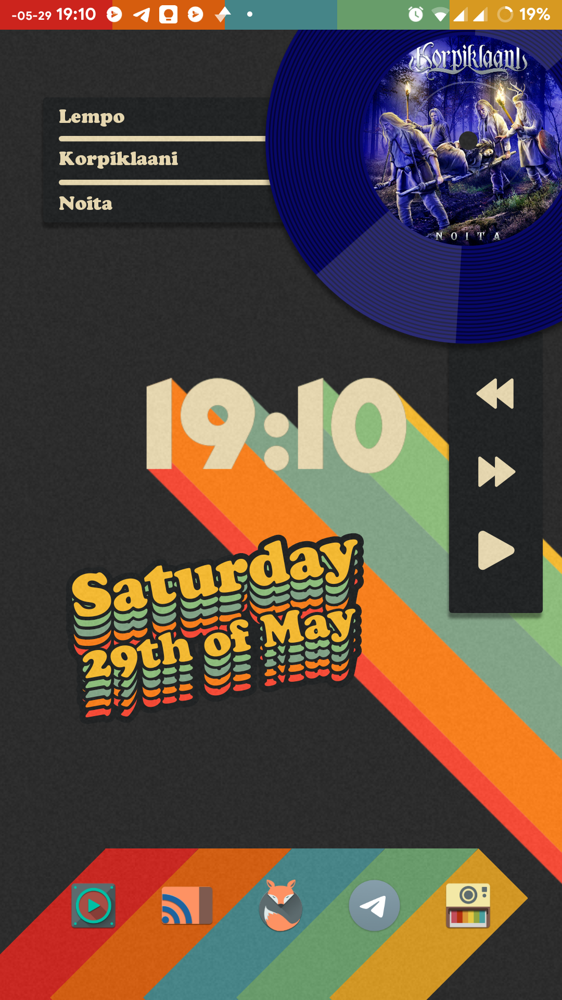
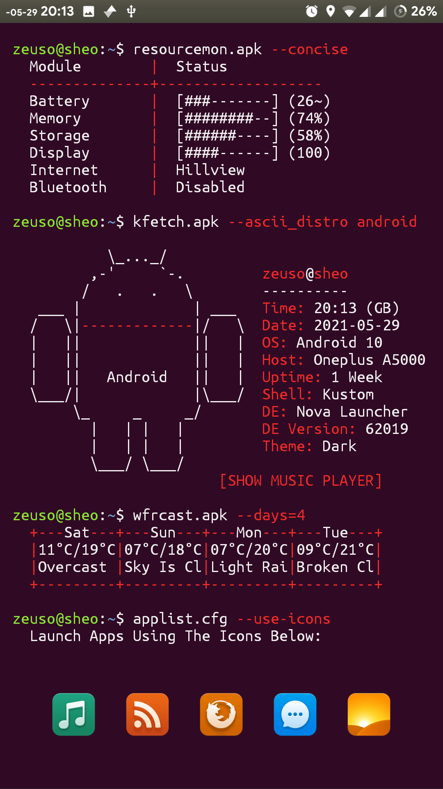

# KLWP Wallpapers

----

### Wood Panelling

My entry to the /r/androidthemes monthly contest

inspired by retro car header units, and VCRs. the central display shows the  current song, or three notifications + wifi ssid if no music is playing. the line under the music is track percentage. the needle meter is  battery, the bars on the left and right are signal, wifi, and bluetooth  speaker battery (if applicable). the icons are bluetooth on/connected,  charging/fast, data, and wifi on/connected.

- Fonts: 
	- [DSegstended](https://github.com/ZeusOfTheCrows/DSegstended/) my own fork of keshikan's dseg font, that adds cyrillic/greek
	- Eurostile SemiBold
	- Rage italic [vice city] removed from shared version, you know how rockstar are
	- Roboto
- Iconfont: material-sharp
- Icon pack: [Arc](https://play.google.com/store/apps/details?id=com.coccco28.arc)
- Everything else: i made myself

​	

----

### Retro Gruvbox

Designed around the Gruvbox colourscheme, bright and vibrant

* Nova Settings:
  * Icon pack: Retrorika
  *  Grid: 6x6

* Fonts: Cooper black; Geomancy

  

  ​	

----

### Casio W-86 Illuminator

I love the Casio Illuminator, I think it's the superior model to the F91-W

* Nova Settings

  * Icon Pack: Flight

* Fonts: Eurostile (various); [DSeg7/14/Weather](https://www.keshikan.net/fonts-e.html)

  
  
  ​	

----

### Kustomfetch

Ubuntu, for all it's flaws, looks really nice by default (at least up until 18.04)

* Nova Settings
  * Icon Pack: MIUI 5

* Fonts: Ubuntu Mono

  

  ​	

----

### Amber Terminal

Similar to kustomfetch, but designed to be a companion to my [WPE wallpaper](https://steamcommunity.com/sharedfiles/filedetails/?id=2271074053)

* Nova Settings

  * Icon Pack: Custom, made with [IPS](https://www.iconpackstudio.com/)

* Fonts: [FixedSys Excelsior](https://github.com/kika/fixedsys)

  

  ​	
